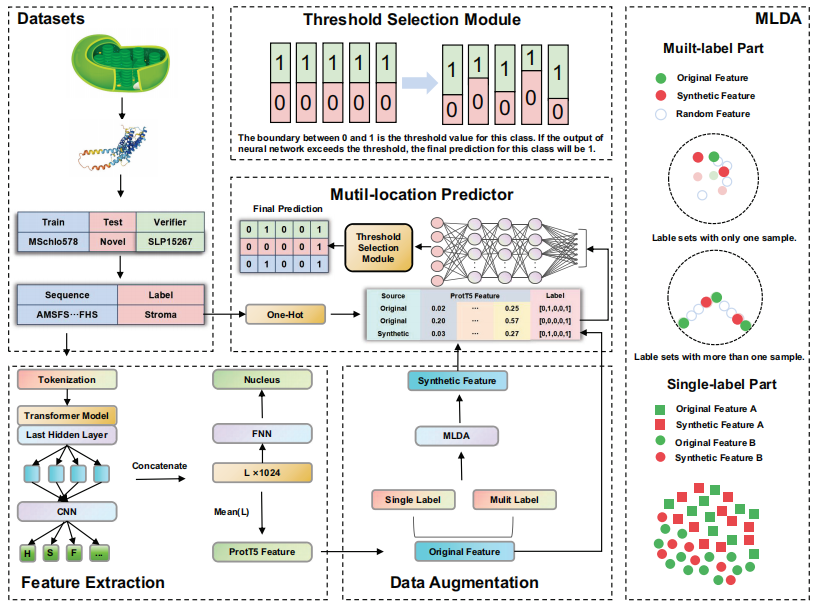

# SLP-T5: Sub-chloroplast Localization Predictor Using Text-to-Text Transfer Transformer

## Overview

SLP-T5 is a novel machine learning model designed to predict the sub-chloroplast localization of proteins. Leveraging the Text-to-Text Transfer Transformer (T5) model, SLP-T5 integrates advanced deep learning techniques, including Multi-Labeled Data Augmentation (MLDA) and a Threshold Selection Module, to address the challenges of data imbalance and limited training datasets. SLP-T5 outperforms existing state-of-the-art models, providing robust, accurate, and efficient predictions.

## Key Features

- **Deep Learning Integration:** Utilizes the ProtT5 model for feature extraction, capturing intricate relationships within protein sequences.
- **Data Augmentation:** Employs MLDA to generate high-quality synthetic feature samples, expanding the training dataset and improving model performance.
- **Threshold Selection Module:** Optimizes decision boundaries to enhance the accuracy of multi-label classifications.
- **Comprehensive Testing:** Validated on multiple datasets, including the MSchlo578 benchmark dataset, the independent Novel dataset, and the newly compiled SLP15267 dataset.

## Datasets
- **MSchlo578 Dataset:** A widely recognized benchmark dataset used for model validation.
- **Novel Dataset:** An independent test set for further validation of model generalization.
- **SLP15267 Dataset:** A newly compiled dataset used to validate SLP-T5's performance on untested protein sequences.

## Results
The experimental results demonstrate that SLP-T5 consistently outperforms existing methods, achieving significant improvements in prediction accuracy and generalization capability.

## License
This project is licensed under the MIT License. See the LICENSE file for details.

## Contact
For questions, comments, or contributions, please reach out to the development team at kongge@ieee.org.